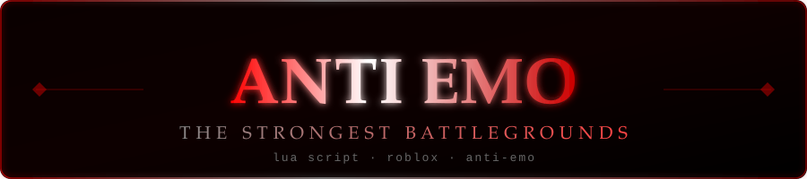

<div align="center">
  
</div>

---

## What is this?

Anti Emo is a Lua-based script for [The Strongest Battlegrounds](https://www.roblox.com/games/10449761493/The-Strongest-Battlegrounds) — a fast-paced anime PvP fighting game on Roblox with over **17 billion visits**, developed by Yielding Arts.

The script fucks everything that moves. If it doesn't, he'll force.

---

## Features

- **Aim Lock** — silent aim with multiple modes (Instant, Lerp, Aggressive, Snap, and more)
- **Prediction** — velocity & movement-based prediction
- **No Collision / No Collision+** — bypass hitbox collision for dashes
- **Velocity Modification** — control your movement dash velocity
- **Cooldown Bars** — visual cooldown tracker for dashes and evasives
- **Trusting System** — part-based trust control
- **Visual Effects** — custom visuals and ignore list
- **Mobile API** — full mobile support with touch aim lock
- **Events System** — aim lock and global event bindings
- **UI Settings** — full theme and save manager

---

## Usage

```lua
loadstring(game:HttpGet("https://raw.githubusercontent.com/anti-emo/axe/refs/heads/software/Anti-Emo.lua"))()
```

---

## History

Development started in **June 2025**. The project was paused at some point and later resumed. Built from scratch — not copied, not forked.

---

## Updates

Maintained and updated irregularly depending on game patches and new mechanics.

---

## Contact

- Discord: **@rwsrwsrwt**
- GitHub: **[github.com/anti-emo](https://github.com/anti-emo)**

---

## License

See [LICENSE](./LICENSE) for full terms.
